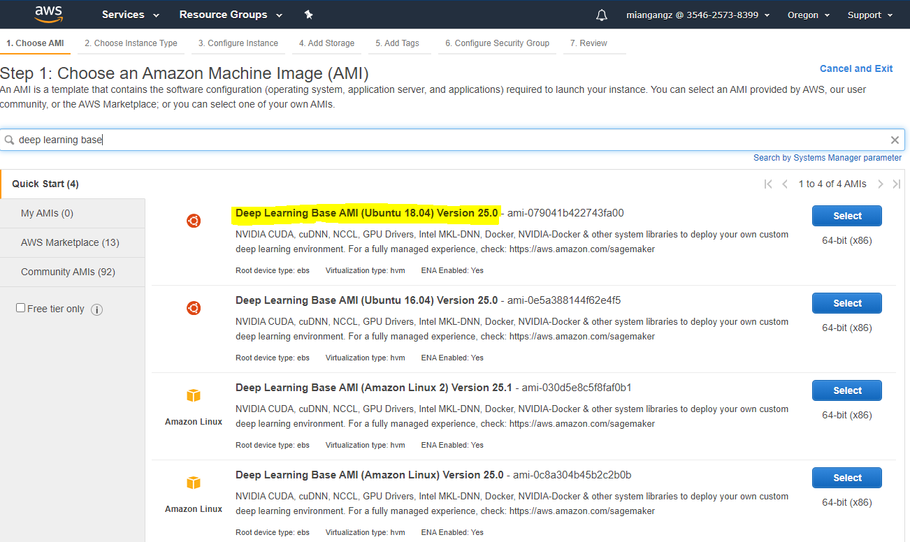
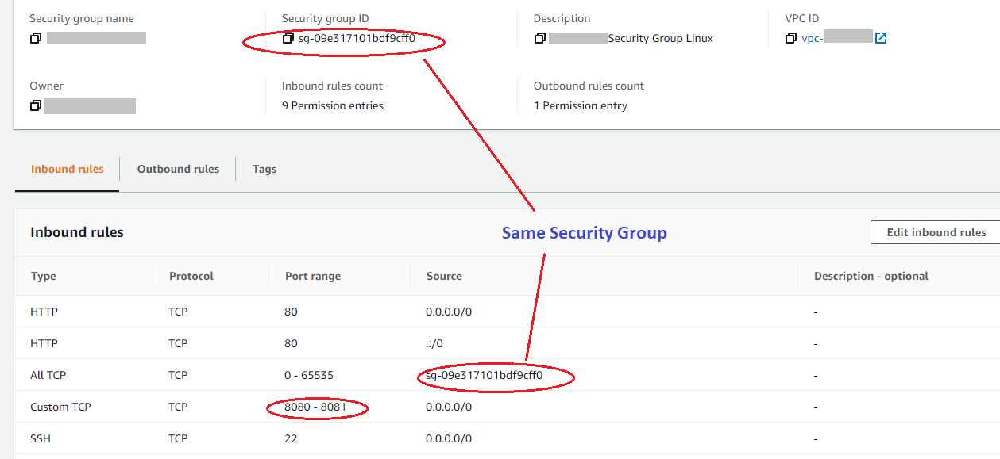
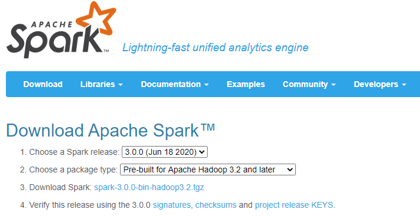
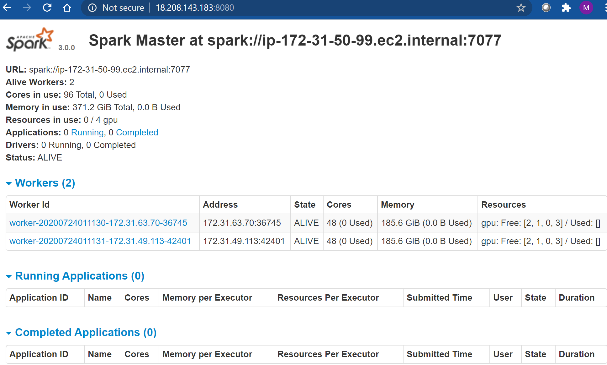

# Get Started with XGBoost4J-Spark 3.0 on AWS EC2
This is a getting started guide to Spark 3.0 on AWS EC2. At the end of this guide, the reader will be able to build a standalone GPU Spark cluster and run a sample Apache Spark application that runs on NVIDIA GPUs.

For more details of AWS EC2 and get started, please check the [AWS document](https://aws.amazon.com/ec2/getting-started/).

# Build a Multiple-Node GPU Spark Standalone Cluster using AWS EC2 Instances 

## **Configure and Launch AWS EC2 Instances**

We will create a cluster with 3 EC2 instances - one m5.xlarge for Master Node and two g4dn.12xlarge for slave nodes. Let Go to AWS Management Console to select a region, e.g. Oregon, and click EC2 service. 

### Step 1:  Launch New Instances with Deep Learning AMI

Click "Launch instance" at the EC2 Management Console, and select "Launch instance".

Search for "deep learning base ami", choose "Deep Learning Base AMI (Ubuntu 18.04)". Click "Select".



### Step 2: Configure EC2 Instance Details

Choose type "g4dn.12xlarge" for slave nodes or "m5.xlarge" for master node.

Set "Number of instances" as 2 for slave nodes and 1 for master node. You can also create placement group for both slave nodes to have higher network throughput.

In "Add Storage" configuration, change the root disk size based on your needed, also you can add ebs volume by clicking "Add New Volume". In this sample, we can set 100G or more. 

### Step 3: Configure Security Group

Select existing or create new security groups for all three instances. Make sure to allow all TCP traffic within this security group and also open 8080 and 8081 port for Internet access to the Spark UI on master node.    

For more details of security group, please check the [AWS document](https://docs.aws.amazon.com/AWSEC2/latest/UserGuide/ec2-security-groups.html).



### Step 4: Final Review and Launch

Review all configuration and launch instances. Choose the same key-pair to launch both master and slave instances.

Alternataively, you can use AWS CLI to launch instance in one command line. Please check the [AWS document](https://docs.aws.amazon.com/cli/latest/userguide/cli-services-ec2-instances.html) 


## **Configure Spark 3.0 Standalone Cluster**

### Step 1:  Install and Verify Nvidia Driver and CUDA 

If you use AWS Deep Learning AMI (Ubuntu 18.04) when launch the instances, we can use the CUDA package pre-installed. We need to use the supported CUDA version (10.1 or 10.2) as multiple CUDA versions are installed in DL AMI. 

SSH into both master and slave instances using the private keys and username ubuntu to adjust t. 

```
cd /usr/local/
sudo rm cuda
sudo ln -s /usr/local/cuda-10.1 cuda
```

If you use Ubuntu 18.04 image when launch the instance, please downlaod [CUDA 10.1](https://developer.nvidia.com/cuda-10.1-download-archive-update2?target_os=Linux&target_arch=x86_64&target_distro=Ubuntu&target_version=1804) or [CUDA 10.2](https://developer.nvidia.com/cuda-10.2-download-archive?target_os=Linux&target_arch=x86_64&target_distro=Ubuntu&target_version=1804) and install the whole package following the steps on the same page. 


### Step 2: Install Apache Spark 3.0 

Download Spark package and set environment variable on both Master and Slave nodes.

The latest Spark 3.x Package can be downloaded from [Apache site](https://spark.apache.org/downloads.html). Make sure you select Spark 3.0.0 and Pre-Built for Apache Hadoop 3.2 or later. 



```
# download the spark
wget https://mirror.olnevhost.net/pub/apache/spark/spark-3.0.0/spark-3.0.0-bin-hadoop3.2.tgz
sudo mkdir -p /opt/spark
sudo chown -R $(id -u):$(id -g) /opt/spark
tar -xvf spark-3.0.0-bin-hadoop3.2.tgz -C /opt/spark/
export SPARK_HOME=/opt/spark/spark-3.0.0-bin-hadoop3.2
```

### Step 3: Download Rapids jars for all the nodes

Download the [RAPIDS plugin](https://repo1.maven.org/maven2/com/nvidia/rapids-4-spark_2.12/). Current version as of 6/202 is 0.1.0: [rapids-4-spark_2.12-0.1.0.jar](https://repo1.maven.org/maven2/com/nvidia/rapids-4-spark_2.12/0.1.0/rapids-4-spark_2.12-0.1.0.jar)    

Download the CUDF files that is mapped to the CUDA version on instances. Inside [this link](https://repo1.maven.org/maven2/ai/rapids/cudf/) you will find files with the version of CUDA designated in the name. 0.14 is the latest version as of 7/2020. And copy jar files under jars/ folder in local Spark folder.

[cudf-0.14-cuda10-1.jar](https://repo1.maven.org/maven2/ai/rapids/cudf/0.14/cudf-0.14-cuda10-1.jar) => CUDA 10.1

[cudf-0.14-cuda10-2.jar](https://repo1.maven.org/maven2/ai/rapids/cudf/0.14/cudf-0.14-cuda10-2.jar) => CUDA 10.2

Here are the examples
```
sudo mkdir -p /opt/sparkRapidsPlugin
sudo chown -R $(id -u):$(id -g) /opt/sparkRapidsPlugin
cd /opt/sparkRapidsPlugin
wget https://repo1.maven.org/maven2/com/nvidia/rapids-4-spark_2.12/0.1.0/rapids-4-spark_2.12-0.1.0.jar
wget https://repo1.maven.org/maven2/ai/rapids/cudf/0.14/cudf-0.14-cuda10-1.jar
cp *.jar /opt/spark/spark-3.0.0-bin-hadoop3.2/jars/
```

### Step 4: Setup SSH Keyless between EC2 instances

Upload your private .pem key file to each EC2 instances and update your private key on instance with following command. 

```
chmod 400 your-key-name.pem
cp your-key-name.pem ~/.ssh/id_rsa
```


### Step 5: Start Master Nodes

On Master node
```
export MASTER_HOST=<your master node internal IP>
export SPARK_HOME=/opt/spark/spark-3.0.0-bin-hadoop3.2
$SPARK_HOME/sbin/start-master.sh
```

Go to the Spark Master UI http://${MASTER_HOST}:8080
Find the Spark URL for the Spark Master. This can be found in the Spark Master logs or from the Spark Master UI. It will likely be: spark://${MASTER_HOST}:7077


### Step 6: Start Slave Nodes

On each slave node, we need to configure the GPU number and the location for GPU Discovery script

```
cp $SPARK_HOME/conf/spark-defaults.conf.template $SPARK_HOME/conf/spark-defaults.conf
```
Edit Spark configuration file - $SPARK_HOME/conf/spark-defaults.conf.  The GPU amount need to be the same as GPU number of each Slave instances.  For g4dn.12xlarge, it is 4 Nvidia T4. 
```
spark.worker.resource.gpu.amount 4
spark.worker.resource.gpu.discoveryScript /opt/spark/spark-3.0.0-bin-hadoop3.2/examples/src/main/scripts/getGpusResources.sh
```

You can start all slave nodes from master node using the scripts provided by Spark. 
Beefore that, You need to add each slave's private IP address to $SPARK_HOME/conf/slaves.
Then you can start all the slaves via script 
```
$SPARK_HOME/sbin/start-slaves.sh
```

You can also start slave node one by one by go into each slave node and run following script 
```
$SPARK_HOME/sbin/start-slave.sh spark://${MASTER_HOST}:7077
```

From Spark Master UI, you should be able to see the slave nodes with GPU resource 



If you can stop the whole cluster on master node by one line
```
$SPARK_HOME/sbin/stop-all.sh
```
You can always stop and then start all the EC2 instances to save the cost when you are not using the cluster.  The public IP address usually will change after restart the instance. But you can use Elastic IP for master node to get a fixed public IP address

Here are the command to start the whole cluster from master node
```
export SPARK_HOME=/opt/spark/spark-3.0.0-bin-hadoop3.2
$SPARK_HOME/sbin/start-master.sh
$SPARK_HOME/sbin/start-slaves.sh
```


## **Running Examples on Spark 3.0 Standalone Cluster**

### Running an example joint operation using Spark Shell

```
$SPARK_HOME/bin/spark-shell \
       --master spark://${MASTER_HOST}:7077 \
       --conf spark.rapids.sql.concurrentGpuTasks=1 \
       --driver-memory 2G \
       --conf spark.cores.max=32 \
       --conf spark.executor.memory=4G \
       --conf spark.executor.cores=4 \
       --conf spark.executor.resource.gpu.amount=1 \
       --conf spark.task.cpus=1 \
       --conf spark.task.resource.gpu.amount=0.25 \
       --conf spark.rapids.memory.pinnedPool.size=2G \
       --conf spark.locality.wait=0s \
       --conf spark.sql.files.maxPartitionBytes=512m \
       --conf spark.sql.shuffle.partitions=10 \
       --conf spark.plugins=com.nvidia.spark.SQLPlugin 
```
if jar file is not copied, please add following two into above command

```
--conf spark.executor.extraClassPath=${SPARK_CUDF_JAR}:${SPARK_RAPIDS_PLUGIN_JAR} \
--conf spark.driver.extraClassPath=${SPARK_CUDF_JAR}:${SPARK_RAPIDS_PLUGIN_JAR} \
```

Once you have started your Spark shell you can run the following scala code to do a basic join and look at the UI to see that it runs on the GPU.
```
val df = sc.makeRDD(1 to 10000000, 6).toDF
val df2 = sc.makeRDD(1 to 10000000, 6).toDF
df.select( $"value" as "a").join(df2.select($"value" as "b"), $"a" === $"b").count
...
res0: Long = 10000000
```
You can Go to the Spark UI and click on the application you ran and on the “SQL” tab. If you click the operation “count at …”, you should see the graph of Spark Execs and some of those should have the label Gpu… For instance, in the screenshot below you will see GpuRowToColumn, GpuFilter, and GpuColumnarExchange. Those correspond to operations that run on the GPU.


### **Launch XGBoost-Spark examples on Spark 3.0 Cluster**

#### Step 1: Download Xgboost4j JARs

**Note: The URLs of jars is still in process, this step may change in future.**

URLs of jars:
* xgboost4j:          https://repo1.maven.org/maven2/com/nvidia/xgboost4j_3.0/1.0.0-0.1.0/
* xgboost4j-spark:    https://repo1.maven.org/maven2/com/nvidia/xgboost4j-spark_3.0/1.0.0-0.1.0/


Download latest version with wget and then Copy cudf and rapids-plugin jar to $SPARK_HOME/jars for both master and slave nodes.

```
cd $SPARK_Home/jars
wget https://repo1.maven.org/maven2/com/nvidia/xgboost4j_3.0/1.0.0-0.1.0/xgboost4j_3.0-1.0.0-0.1.0.jar
wget https://repo1.maven.org/maven2/com/nvidia/xgboost4j-spark_3.0/1.0.0-0.1.0/xgboost4j-spark_3.0-1.0.0-0.1.0.jar
```


#### Step 2: Build spark xgboost example
Follow the [guide](/getting-started-guides/building-sample-apps/scala.md) or following steps to build the example jar.

##### Download and install latest Maven
```
wget http://apache.mirrors.lucidnetworks.net/maven/maven-3/3.6.3/binaries/apache-maven-3.6.3-bin.zip
unzip apache-maven-3.6.3-bin.zip
export PATH=/home/hadoop/apache-maven-3.6.3/bin:$PATH
mvn --version
````
Then build Example Jars
```
git clone https://github.com/NVIDIA/spark-xgboost-examples.git
cd spark-xgboost-examples/examples/apps/scala
mvn package -Dcuda.classifier=cuda10-1
```
##### Generated Jars

The build process generates two jars:

+ *sample_xgboost_apps-0.2.2.jar* : only classes for the examples are included, so it should be submitted to spark together with other dependent jars
+ *sample_xgboost_apps-0.2.2-jar-with-dependencies.jar*: both classes for the examples and the classes from dependent jars are included

##### Build Options

Classifiers:

+ *cuda.classifier*
    + For CUDA 10.1 building, specify *cuda10-1*
    + For CUDA 10.2 building, specify *cuda10-2*


#### Step 3: Adding JAR files for AWS S3 support

If your dataset is on S3, you should download below jar files to enable the accessing of S3. In this sample, we will use data on S3.
The jars should under $SPARK_HOME/jars on both master and slave nodes.

```
cd $SPARK_HOME/jars
wget https://github.com/JodaOrg/joda-time/releases/download/v2.10.5/joda-time-2.10.5.jar
wget https://repo1.maven.org/maven2/org/apache/hadoop/hadoop-aws/3.2.0/hadoop-aws-3.2.0.jar
wget https://repo1.maven.org/maven2/com/amazonaws/aws-java-sdk/1.11.687/aws-java-sdk-1.11.687.jar
wget https://repo1.maven.org/maven2/com/amazonaws/aws-java-sdk-core/1.11.687/aws-java-sdk-core-1.11.687.jar
wget https://repo1.maven.org/maven2/com/amazonaws/aws-java-sdk-dynamodb/1.11.687/aws-java-sdk-dynamodb-1.11.687.jar
wget https://repo1.maven.org/maven2/com/amazonaws/aws-java-sdk-s3/1.11.687/aws-java-sdk-s3-1.11.687.jar
```


#### Step 4: Create sample running script

Create running run.sh script with below content, make sure change the paths in it to your own. Also your aws key/secret.  You can adjust total cores, number of executors, executor memory and overhead memory accordingly based on your slave nodes. Following example is for 2x g4dn.12xlarge slave nodes.

```
#!/bin/bash

export SPARK_HOME=/opt/spark/spark-3.0.0-bin-hadoop3.2

export PATH=$SPARK_HOME/bin:$SPARK_HOME/sbin:$PATH

export TOTAL_CORES=64
export NUM_EXECUTORS=8
export NUM_EXECUTOR_CORES=$((${TOTAL_CORES}/${NUM_EXECUTORS}))

export S3A_CREDS_USR=your_aws_key

export S3A_CREDS_PSW=your_aws_secret

export JAR_PATH=$SPARK_HOME/jars

export JARS=$JAR_PATH/xgboost4j-spark_3.0-1.0.0-0.1.0.jar,$JAR_PATH/xgboost4j_3.0-1.0.0-0.1.0.jar

spark-submit --master spark://$HOSTNAME:7077 \
        --deploy-mode client \
        --driver-memory 10G \
        --executor-memory 24G \
        --conf spark.hadoop.fs.s3a.impl=org.apache.hadoop.fs.s3a.S3AFileSystem \
        --conf spark.hadoop.fs.s3a.access.key=$S3A_CREDS_USR \
        --conf spark.hadoop.fs.s3a.secret.key=$S3A_CREDS_PSW \
        --conf spark.executor.memoryOverhead=28G \
        --conf spark.cores.max=$TOTAL_CORES \
        --conf spark.executor.cores=$NUM_EXECUTOR_CORES \
        --conf spark.task.cpus=$NUM_EXECUTOR_CORES \
        --conf spark.sql.files.maxPartitionBytes=4294967296 \
        --conf spark.yarn.maxAppAttempts=1 \
        --conf spark.plugins=com.nvidia.spark.SQLPlugin \
        --conf spark.rapids.memory.gpu.pooling.enabled=false \
        --conf spark.executor.resource.gpu.amount=1 \
        --conf spark.task.resource.gpu.amount=0.125 \
        --jars $JARS \
        --class com.nvidia.spark.examples.mortgage.GPUMain \
        $JAR_PATH/sample_xgboost_apps-0.2.2.jar \
        -num_workers=${NUM_EXECUTORS} \
        -format=csv \
        -dataPath="train::s3a://spark-xgboost-mortgage-dataset/csv/train/2000Q1" \
        -dataPath="trans::s3a://spark-xgboost-mortgage-dataset/csv/eval/2000Q1" \
        -numRound=100 -max_depth=8 -nthread=$NUM_EXECUTOR_CORES -showFeatures=0 \
        -tree_method=gpu_hist
```

#### Step 5: Submit Sample job
Run run.sh

```
./run.sh
```

After running successfully, the job will print an accuracy benchmark for model prediction. The actual number varies based on the parameters for XGBoost and the Spark cluster settings.

```
--------------
==> Benchmark: Elapsed time for [Mortgage GPU train csv stub Unknown Unknown Unknown]: 1814.007s
--------------
......
--------------
==> Benchmark: Elapsed time for [Mortgage GPU transform csv stub Unknown Unknown Unknown]: 699.062s
--------------
.....
--------------
==> Benchmark: Accuracy for [Mortgage GPU Accuracy csv stub Unknown Unknown Unknown]: 0.9908929184425261
--------------
```

To run the example toward 20-year Mortgage data instead of a partial data in abovec example, you can modify the data path

```
-dataPath="train::s3a://spark-xgboost-mortgage-dataset/csv/train/20*" \
-dataPath="trans::s3a://spark-xgboost-mortgage-dataset/csv/eval/20*" \
```
You can also change number of rounds and depth in above example, for example:

```
-numRound=1000 -max_depth=20 -nthread=$NUM_EXECUTOR_CORES 
```
